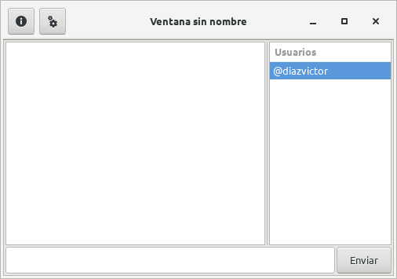
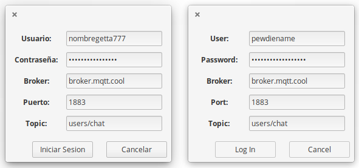

# MoonZaphire
MoonZaphire is a GTK3 frontend for MQTT written in Lua.

## This software requires:
* [lua5.1](https://www.lua.org/download.html) or [luajit2.0.5](https://luajit.org/)
* [lgi](https://github.com/pavouk/lgi)
* [mosquitto/mqtt](http://mqtt.org/)
* [lua-mosquitto](https://github.com/flukso/lua-mosquitto/)

## Run
Execute: `init.lua` with Lua5.1 (or LuaJIT)

## Screenshots

## Contacts
- Email: [victor.vector008@gmail.com](mailto:victor.vector008@gmail.com)
- Website: [https://diazvictor.gitlab.io](https://diazvictor.gitlab.io)
- Telegram: [https://t.me/diazvictor](https://t.me/diazvictor)
